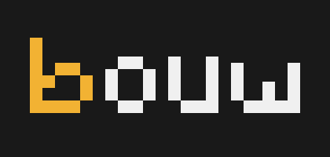

# Bouw - A 3D model printer for ComputerCraft
Bouw reads bouw model files (`.bm`) and builds them in your world using a turtle. 

## Bouw program
To build a model, place a turtle on the bottom-right corner of the bounding-box of your build (when viewed from above). Then, simply run `bouw` with the model file as its first argument.

## Bouw models
Bouw model files consist of two parts: a header and a body.
1. The header contains lines with the format `%key=block_id` that defines the correspondences between block keys and block id's
2. The body contains lines of the format `x y z block_key` which contain the coordinates of each block with the block_key that is to be placed in that position.

An example `.bm` file looks like this:
```
%dirt=minecraft:dirt
%oak=minecraft:oak_planks
-10 -3 0 dirt
-8 -3 0 dirt
-10 -2 0 dirt
-10 -1 0 dirt
-9 -1 0 dirt
-8 -1 0 dirt
-8 -3 1 dirt
-10 -2 1 oak
-10 -1 1 oak
-9 -1 1 oak
```

You do not have to worry about the coordinates being normalized around 0: `bouw` does that automatically for you.

## Creating bouw model files
To create bouw model files, you may use [Goxel](https://goxel.xyz/) and export your model to a text-file format. You may then manually add the header defining the block keys.

## Installing bouw
To install `bouw` on your computer, you can run `pastebin run <GENERATE CODE>` on your turtle of choice in the folder in which you want to install `bouw`.

## Building bouw
To build `bouw` yourself, you have to use `tl`, a transpiler for the Teal programming language, a typed dialect of Lua. Simply use `tl build` with the root folder of this repo as the working directory.

